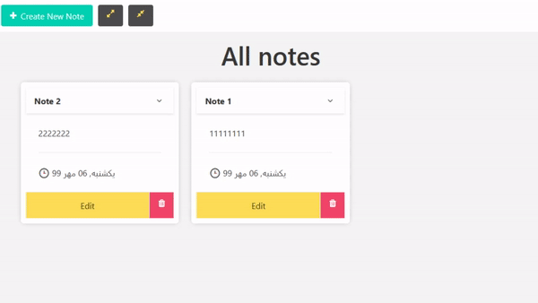

## Simple Note Page in Laravel 

if you want to use it just create a database with any name you want and config it in the .env file, then run the folowing steps:

1. composer install
2. rename '.env.example' file to '.env' and use your Databse configs
3. php artisan key:generate
4. php artisan migrate
5. npm install && npm run dev

and in the finall use the 'php artisan serve' and use it😅

